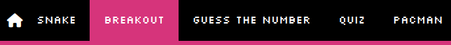

# **GAMING GAUNTLET**

 
Gaming gauntlet is a project designed around my love of gaming and challenge. As I felt my JavaScript knowledge is not quite advanced enough to create a game as complex and challenging as I would like to, the compromise I came to in that case is multiple simpler and easier games played consecutively. With the difficulty and score multiplier  changing in each game dependant on your performance in the previous one. 

 

The aim is to make 5 easily accessible and understandable games which will be played in a "gauntlet" style with no breaks in between. The order is up to the player with each consecutive win making the subsequent game harder while offering more points towards your final score. Hopefully creating the complexity and replay-ability I am aiming for without having that deeper coding knowledge I am just shy of at the moment 

 

[Link](https://eeebeedee.github.io/gaming_gauntlet/) to deployed site

 

## UX 

 

### User stories

 

* #### First time user goals

    * As a first time user, I want to be easily navigate the website
    * As a first time user, I want my viewing experience to be smooth on any device I use.
    * As a first time user, I want the website's aim and goals to be easily understood and readily available .
    * As a first time user, I want the controls and aim of the games included to be intuitive and easy to pick up.
    * As a first time user, I hope to enjoy what is on offer and potentially find in this site something I can come back to and enjoy again. 

     

* #### Returning user goals

    * As a returning visitor, I want to feel like return visits will offer increasing value.
    * As a returning visitor, I want to easily see any improvement made by myself with multiple uses of the website.  
    *  As a returning visitor, I want to feel after this visit there will still be more reason for me to keep returning.

 

### Design

 

#### Colour Scheme

 

 

For this project the selected colours are used separately, each one being the primary colour for a single game with black, white and shades of gray used for everything else.

The limited colour palette for each single game is to try and reference the style of 4 and 8 bit games. This idea carries over to my color choice also as I tried to pick strong vivid colours that also reminded me of the 80s and 80s media.

 

#### Typography

 

For typography I decided to go for a singular font from [Google Fonts](https://fonts.google.com/) called Silkscreen. This was chosen for its retro feel and it gels well with the overall theme of playing old school games on a CRT Television. 

 

## Features

 

### Navbar

 

 

#### For desktop - tablet

 

- Simple old school layout to keep in line with the overall old school aesthetic.
- Whichever game is selected on the nav bar is highlighted by its background changing to the active primary color.
- Game link is greyed out and unselectable after completion as seen above unless game is restarted or home page is loaded again.

 

#### For mobile

 

- same principles as desktop menu.
- Active game moves to below navbar to free up space and keep other links with enough breathing space. 
- Home menu button only appears on the game pages now.

 

### Home Page

 

 

- The CRT motif is shared througout the project and does not change other than primary colour for any html page. All content save the navbar is displayed within here.
- On the home page the core concept is explained along with arrow buttons to allow navigation to tutorial pages for all the games.
-  for mobile the only change is the dimensions of the CRT to allow the content to be viewed better on small screens. (see below:)

 

 

### Snake

 

 

- Made using HTML canvas
- Controlled with the four arrows keys.
- Aim of the game is to eat 25 pieces of food within 2 lives.
- Increased difficulty from winning previous games increases the speed of the snakes movement
- For mobile four on screen buttons are used to substitute for the directional buttons. (see below:)

 

 

### Breakout

 

 

- Made using HTML canvas
- Controlled with the left and right arrows keys.
- Aim of the game is to clear 45 tiles within one life.
- Increased difficulty from winning previous games increases the speed of the ball
- For mobile two on screen buttons are used to substitute for the left and right arrows, along with the size of the paddle increasing to compensate for the reliance on touch screen buttons. (see below:)

 

 

### Guess The Number
 

 

- Given a certain amount of lives you must guess the correct number using a few hints a you guess.
- Increased difficulty from winning previous games increase the range of possible numbers while granting you an extra life to guess.

 

### Quiz
 

 

- Correctly guess 6 of 10 questions correctly to win the game.
- used Open Triva Database's API to source questions.
- Increased difficulty from winning previous games increase the difficulty of the questions ranging from gaming triva(easy-med-hard) to computer science(med-hard).
- On mobile font size and padding are reduced to keep all information onscreen at smaller sizes. (see below:)

 

 

## Technologies Used

### Languages Used

-   [HTML5](https://en.wikipedia.org/wiki/HTML5)
-   [CSS3](https://en.wikipedia.org/wiki/Cascading_Style_Sheets)
-   [Javascript](https://en.wikipedia.org/wiki/JavaScript)

### Tools Used

- [Google Fonts:](https://fonts.google.com/)
    - Google fonts was used to import the 'Silkscreen' font used throughout the entire website.
- [Font Awesome:](https://fontawesome.com/)
    - Font Awesome was used for the icon in the Navbar. and the chevron arrows in the buttons
- [Git](https://git-scm.com/)
    - Git was used for version control and to Push to GitHub.
- [GitHub:](https://github.com/)
    - GitHub is used to store the project's code remotely and then to host the static website on GitHub Pages.
- [VScode](https://code.visualstudio.com/)
    - Vscode was my code editor for this project.

## Testing

Please find all information pertaining to testing in [TESTING.md](TESTING.md)

## Deployment

The site was deployed to GitHub pages. The steps to deploy are as follows: 
  - In the [GitHub repository](https://github.com/EeeBeeDee/gaming_gauntlet), navigate to the Settings tab 
  - From the source section drop-down menu, select the **Main** Branch, then click "Save".
  - The page will be automatically refreshed with a detailed ribbon display to indicate the successful deployment.

The live link can be found [here](https://eeebeedee.github.io/gaming_gauntlet/)

### Local Deployment

In order to make a local copy of this project, you can clone it. In your IDE Terminal, type the following command to clone my repository:

- `git clone https://github.com/EeeBeeDee/gaming_gauntlet.git`

Alternatively, if using Gitpod, you can click below to create your own workspace using this repository.

### Acknowledgements

[Tim_nelson](https://tim.2bn.dev/) - My CI mentor for all the guidance, tips and tricks. 

The CI slack channel for all the tips, tricks and help.

[Alec Clowns](aleclownes.com) For the crt filter display he created with just CSS.

