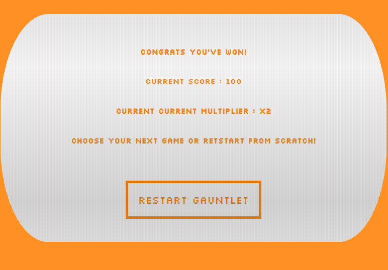
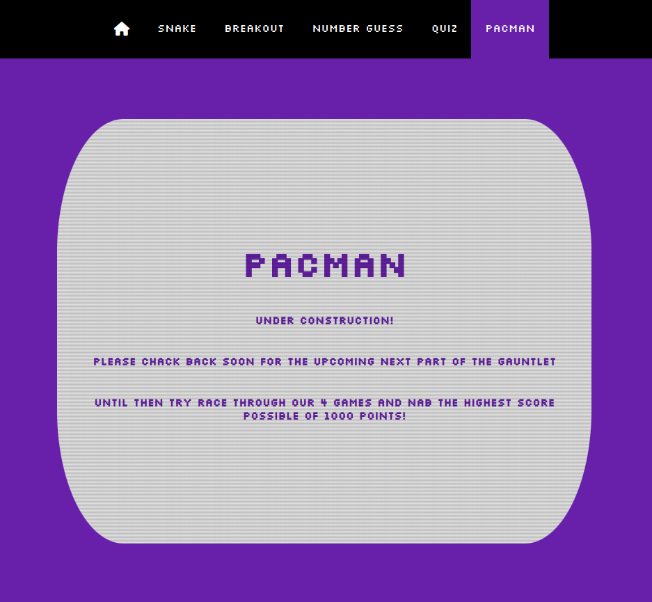
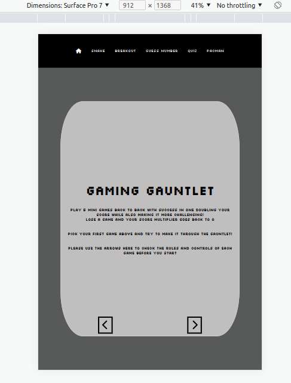
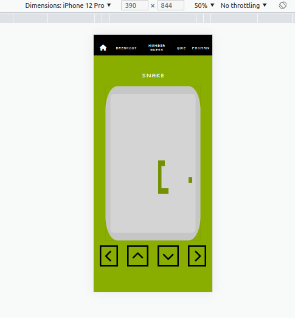

# Testing 

## Code validation 

### HTML

#### Index

#### Snake

#### Breakout

#### Number Guess

#### Quiz

#### Pacman

All my HTML files showed no warnings or errors when validated.

### CSS

#### Style

#### Utilities

#### CRT filter

All my CSS files showed no warnings or errors when validated.

### Javascript

#### App js

#### Snake

#### Breakout

#### Number Guess

#### Quiz

My javascript files showed no errors. The only issue is some pages show undefined variables due to the fact that some global variables that are shared are stored solely on the app.js file.

## Testing User stories

### First time user goals

 * As a first time user, I want to be easily navigate the website
 
    * The navbar for this site is very straightforward and easily accessible at all times at the  top of the page

* As a first time user, I want my viewing experience to be smooth on any device I use.
    * See [Responsiveness](#responsiveness). I am happy that the viewing experience is smooth on any size screen above a width of 350px.

* As a first time user, I want the website's aim and goals to be easily understood and readily available.
* As a first time user, I want the controls and aim of the games included to be intuitive and easy to pick up.

    * The very first screen is a tutorial on how to play all the games and how the scoring system works.

* As a first time user, I hope to enjoy what is on offer and potentially find in this site something I can come back to and enjoy again.
    * With each game getting progressively harder if you manage to best your previous game, I feel the ability to keep challenging yourself to see new game difficulties would be enough of a draw to bring people back.

 ### Returning user goals

* As a returning visitor, I want to feel like return visits will offer increasing value.
    * As stated above I feel the increased challenge as you get better at the games give incentive to come back and replay.

* As a returning visitor, I want to easily see any improvement made by myself with multiple uses of the website.

  
    * A results screen after every attempt lets you keep track of your current total score and multiplier.

*  As a returning visitor, I want to feel after this visit there will still be more reason for me to keep returning.

    
    * Room for expansion can be seen here with the pacman game. The code has been written in a fairly modular way which allows for insertion of plenty more games with only slight adjustments to the code base.

 

## Compatibility 

#### Chrome

#### Opera

#### Firefox

Above are images of the site working on chrome on desktop, opera with tablet dimensions and firefox with mobile dimensions.

## Responsiveness

#### Tablet

#### Mobile

Above are images of the site working in desktop ,tablet and mobile dimensions.

## Unfixed bugs 

During the breakout game the bottom right brick does not interact with the ball as expected even though it is generated though the same function as the rest of the the bricks. I couldn't remedy this even with a significant amount of time testing different methods and decided it was taking up too much of my time.