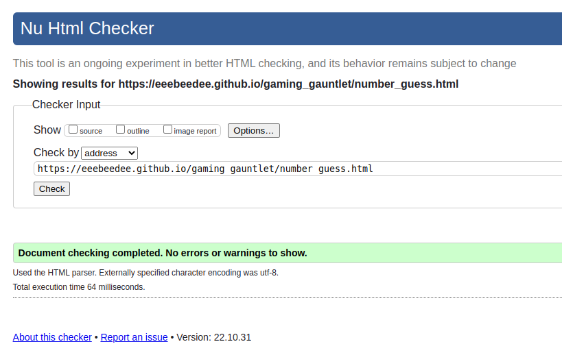

# Testing 

## Code validation 

### HTML

#### Index

#### Snake

#### Breakout

#### Number Guess

#### Quiz

#### Pacman

All my HTML files showed no warnings or errors when validated.

### CSS

#### Style

#### Utilities

#### CRT filter

All my CSS files showed no warnings or errors when validated.

### Javascript

#### App js

#### Snake

#### Breakout

#### Number Guess

#### Quiz

My javascript files showed no errors. The only issue is some pages show undefined variables due to the fact that some global variables that are shared are stored solely on the app.js file 

## Compatibility 

#### Chrome

#### Opera

#### Firefox

Above are images of the site working on chrome on desktop, opera with tablet dimensions and firefox with mobile dimensions.

## Unfixed bugs 

During the breakout game the bottom right brick does not interact with the ball as expected even though it is generated though the same function as the rest of the the bricks. I couldn't remedy this even with a significant amount of time testing different methods and decided it was taking up too much of my time.